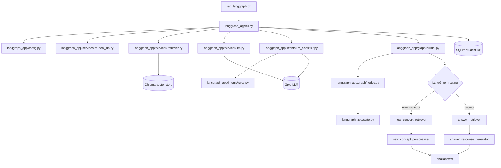
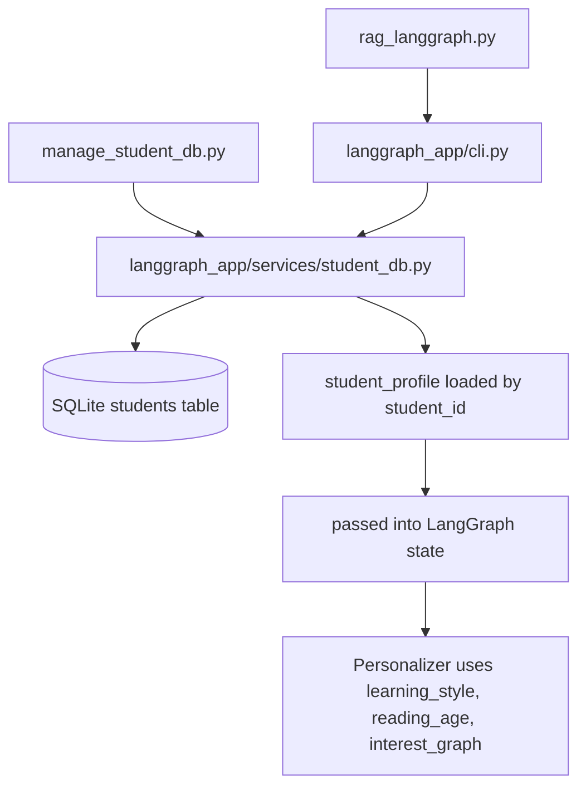

# NeuroLearn Flow Map

This file shows how the current code travels through the repository at runtime.

## Runtime Flow



## Student Profile Flow



## File Roles

- `rag_langgraph.py`: thin entrypoint that starts the app.
- `langgraph_app/cli.py`: loads `.env`, reads `student_id`, fetches student profile, and runs the graph.
- `langgraph_app/services/student_db.py`: SQLite student profile storage and lookup.
- `manage_student_db.py`: standalone script to add, get, and list student profiles.
- `langgraph_app/services/retriever.py`: Chroma retrieval.
- `langgraph_app/services/llm.py`: Groq answer generation and personalization.
- `langgraph_app/intents/llm_classifier.py`: LLM-based intent classification.
- `langgraph_app/intents/rules.py`: deterministic intent fallback.
- `langgraph_app/graph/builder.py`: LangGraph wiring and conditional routing.
- `langgraph_app/graph/nodes.py`: node factories for orchestration, retrieval, personalization, and response generation.
- `langgraph_app/state.py`: shared graph state.
- `langgraph_app/config.py`: runtime constants.

## Current End-to-End Runtime

1. `rag_langgraph.py` starts the program.
2. `langgraph_app/cli.py` loads config and environment.
3. `langgraph_app/services/student_db.py` fetches the student profile by `student_id`.
4. `langgraph_app/services/retriever.py` loads matching chunks from Chroma.
5. `langgraph_app/intents/llm_classifier.py` classifies the user input.
6. `langgraph_app/graph/builder.py` routes the flow based on intent.
7. `langgraph_app/graph/nodes.py` runs retrieval, personalization, or response generation nodes.
8. `langgraph_app/services/llm.py` generates the Malayalam output.
9. `langgraph_app/state.py` carries the shared state between nodes.

## Example Command Flow

```bash
python .\manage_student_db.py add --student-id s1 --learning-style analogy-heavy --reading-age 12 --interests games stories daily-life
python .\rag_langgraph.py --student-id s1 --text "പഠന രീതി എന്താണ്?"
```

If you want, I can also make this into a cleaner block diagram that separates the runtime files from the data files more visually.