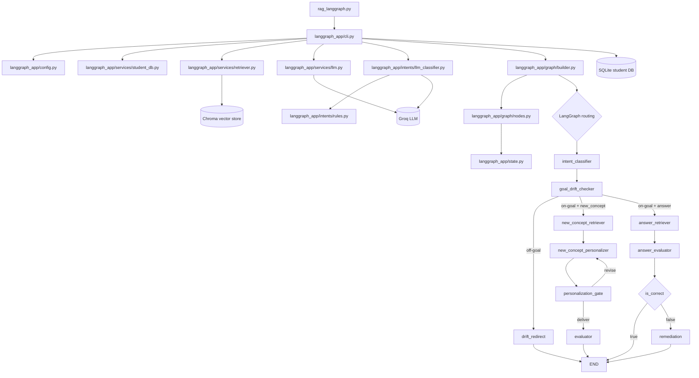
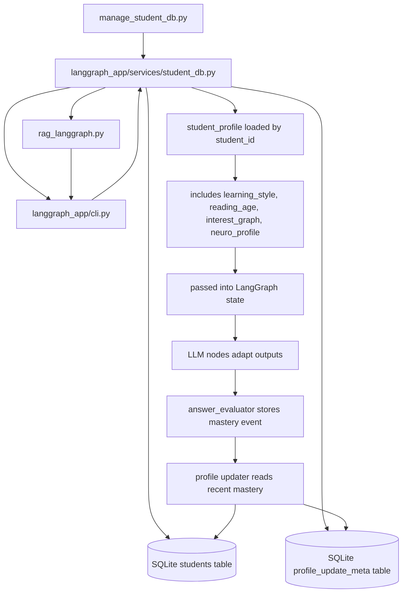

# NeuroLearn Flow Map

This file shows how the current code travels through the repository at runtime.

## Document Status

- Scope: runtime file and node flow
- Audience: developers and maintainers
- Status: current MVP implementation map

## Runtime Flow



## Student + Goal + Mastery Data Flow



## File Roles

- `rag_langgraph.py`: thin entrypoint that starts the app.
- `langgraph_app/cli.py`: loads `.env`, reads `student_id`, fetches student profile, and runs the graph.
- `langgraph_app/services/student_db.py`: SQLite storage for students, goals, mastery events, and profile update metadata.
- `manage_student_db.py`: script for student, mastery, and learning-goal management.
- `langgraph_app/services/retriever.py`: Chroma retrieval with source/page/chunk metadata.
- `langgraph_app/services/llm.py`: Groq generation, personalization, evaluation, remediation, and goal drift checking.
- `langgraph_app/intents/llm_classifier.py`: LLM-based intent classification.
- `langgraph_app/intents/rules.py`: deterministic intent fallback.
- `langgraph_app/graph/builder.py`: LangGraph wiring and conditional routing.
- `langgraph_app/graph/nodes.py`: node factories for orchestration, drift checking, retrieval, personalization, evaluation, and remediation.
- `langgraph_app/state.py`: shared graph state.
- `langgraph_app/config.py`: runtime constants.

## Current End-to-End Runtime

1. `rag_langgraph.py` starts the program.
2. `langgraph_app/cli.py` loads config and environment.
3. `langgraph_app/services/student_db.py` fetches student profile (including `neuro_profile`) by `student_id`.
4. `langgraph_app/intents/llm_classifier.py` classifies input as `new_concept` or `answer`.
5. `goal_drift_checker` compares query with active learning goal.
6. Off-goal queries go to `drift_redirect`; on-goal queries continue.
7. `langgraph_app/services/retriever.py` loads matching chunks from Chroma.
8. `new_concept` path runs personalizer -> Gate A -> evaluator (check question).
9. `answer` path runs evaluator -> remediation if incorrect.
10. Answer evaluator stores mastery events and triggers guarded profile updater.
11. CLI prints answer and answer source lines (textbook/page/chunk/json hint).

## Example Command Flow

```bash
python .\manage_student_db.py add --student-id s1 --learning-style analogy-heavy --reading-age 12 --interests chess football --neuro-profile adhd dyslexia
python .\manage_student_db.py set-goal --student-id s1 --goal "Learn handwashing and hygiene basics"
python .\rag_langgraph.py --student-id s1 --text "പഠന രീതി എന്താണ്?"
```

## Related Docs

- [README.md](README.md)
- [plan.md](plan.md)
- [FROM_SCRATCH_SUMMARY.md](FROM_SCRATCH_SUMMARY.md)
- [FULL_TEST_RUNBOOK.md](FULL_TEST_RUNBOOK.md)