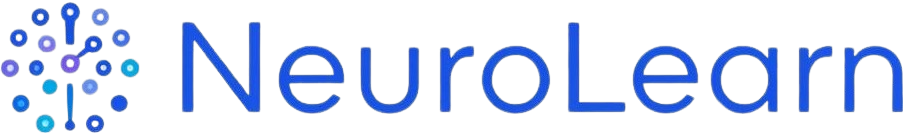

# NeuroLearn: Adaptive AI Tutor for Neurodivergent Learners

[](https://www.python.org/downloads/release/python-390/)
[](https://opensource.org/licenses/MIT)
[](https://github.com/ellerbrock/open-source-badges/)
[](http://makeapullrequest.com)

**NeuroLearn** is an open-source, adaptive AI tutoring platform designed specifically for **neurodivergent students**. Recognizing that everyone learns differently, our AI dynamically tailors its teaching approach to suit individual needs.

NeuroLearn focuses on student-centered learning support with adaptive explanations, guided remediation, mastery tracking, and profile-aware tutoring so each learner can progress in a way that works for them.

## 📑 Table of Contents
- [Highlights](#-highlights)
- [Quick Start](#-quick-start)
- [Usage](#-usage)
- [Guides and Concepts](#-guides-and-concepts)
- [Philosophy](#-philosophy)

## ✨ Highlights

- **Adaptive Learning AI:** Automatically adjusts its teaching approach based on the student's specific neurodivergent profile, learning style, and reading age.
- **Guided Focus & Remediation:** Features a LangGraph-based tutor with learning-goal drift checking to gently guide students back on track if they lose focus.
- **Mastery Tracking:** Persists learning milestones and mastery events (via SQLite) to continuously improve the AI's understanding of the student over time.
- **Personalized Check Questions:** Generates follow-up checks to confirm understanding before moving to the next concept.
- **Source-Grounded Answers:** Keeps traceable links to learning content so explanations can be tied back to where the concept came from.
- **Retrieval Hardening:** Filters weak chunks, deduplicates near-duplicates, and reranks candidates before they reach the prompt.

## 🚀 Quick Start

### Prerequisites
Core runtime:

| Dependency | Installation |
|---|---|
| **Python** | 3.9 or higher |
| **Groq API Key** | Set `GROQ_API_KEY` in `.env` or your shell |

Optional (only if you run the PDF content pipeline):

| Dependency | Installation |
|---|---|
| **Tesseract OCR** | `sudo apt install tesseract-ocr` or [Windows Installer](https://github.com/UB-Mannheim/tesseract/wiki) |
| **Malayalam Data** | `sudo apt install tesseract-ocr-mal` (Linux). For Windows, place `mal.traineddata` in the `tessdata` directory. |
| **Poppler** | `sudo apt install poppler-utils` or [Poppler for Windows](https://github.com/oschwartz10612/poppler-windows) (required by `pdf2image`) |

### Setup & Installation
1. **Clone the repository:**
   ```bash
   git clone https://github.com/arxhr007/neurolearn.git
   cd neurolearn
   ```

2. **Install Python dependencies:**
   ```bash
   pip install -r requirements.txt
   ```

3. **Configure the Environment:**
   Create a `.env` file in the project root to store your Groq API Key (required for `rag.py`):
   ```env
   GROQ_API_KEY=your_key_here
   ```

## 🎯 Usage

### 1. LangGraph AI Tutor Application
Manage student profiles and interact with the adaptive AI tutor.

**Create/Update a student profile:**
```bash
# Interactive mode
python manage_student_db.py

# Non-interactive mode (Example: Student with ADHD & Dyslexia, learns best through analogies)
python manage_student_db.py add --student-id s100 --name "Test User" \
  --learning-style analogy-heavy --reading-age 12 --interests chess football \
  --neuro-profile adhd dyslexia
```

**Set Active Learning Goal:**
```bash
python manage_student_db.py set-goal --student-id s100 --goal "Learn handwashing and hygiene basics"
```

**Run a Query:**
```bash
python rag.py --student-id s100

# Then type your question interactively when prompted
# Example: കൈകഴുകൽ എന്തുകൊണ്ട് പ്രധാനമാണ്?

# Optional retrieval tuning for stricter grounding
python rag.py --student-id s100 \
   --retrieval-candidate-k 20 \
   --retrieval-min-similarity 0.35
```

**Inspect Profile & Mastery:**
```bash
python manage_student_db.py get --student-id s100
python manage_student_db.py mastery --student-id s100 --limit 20
```

### 2. Optional Content Processing Pipeline
Use this when you want NeuroLearn to teach from your own Malayalam educational PDFs.

```bash
# Default (Reads from input/pdfs, outputs to output/rag_chunks)
python pipeline/pdf_content_pipeline.py

# Custom configurations
python pipeline/pdf_content_pipeline.py \
    --input ./input/pdfs \
    --output ./output/rag_chunks \
    --workers 8 \
    --dpi 300 \
    --chunk-size 500 \
    --chunk-overlap 100

# Build / refresh the vector index from generated chunks
python pipeline/build_vector_index.py
```

## 📄 License
This project is open-source and available under the [MIT License](LICENSE).

## 📚 Guides and Concepts
To understand the project and how to work with it, start with these docs:
- **[SETUP.md](docs/SETUP.md)**: Local installation, environment variables, and smoke test steps.
- **[ARCHITECTURE.md](docs/ARCHITECTURE.md)**: System design, runtime flow, and main components.
- **[INTERFACES.md](docs/INTERFACES.md)**: Entry points, services, and important project-level interfaces.
- **[DATA_FORMATS.md](docs/DATA_FORMATS.md)**: Student profile, mastery, chunk, and vector store formats.
- **[TROUBLESHOOTING.md](docs/TROUBLESHOOTING.md)**: Common setup and runtime issues.
- **[CONTRIBUTING.md](docs/CONTRIBUTING.md)**: How to work on the repo safely.
- **[DEPLOYMENT.md](docs/DEPLOYMENT.md)**: Current CLI-first deployment notes and what would need to change for hosting.
- **[EXAMPLES.md](docs/EXAMPLES.md)**: Example student flows and pipeline usage.
- **[TESTING.md](docs/TESTING.md)**: Validation checklist and testing workflow.

Internal notes and build history:
- **[FLOW.md](docs/FLOW.md)**: Detailed mapping of the data flow and AI interactions.
- **[plan.md](docs/plan.md)**: Roadmap, goals, and architectural plans.
- **[FROM_SCRATCH_SUMMARY.md](docs/FROM_SCRATCH_SUMMARY.md)**: A summary of how the project was built and its foundational principles.

## 💡 Philosophy

> "If a child can't learn the way we teach, maybe we should teach the way they learn."  
> — Ignacio Estrada

NeuroLearn is built on the belief that **education should adapt to the student, not the other way around.** Traditional, one-size-fits-all learning paradigms often leave neurodivergent learners behind, creating unnecessary friction in their educational journeys. By leveraging AI to understand, accommodate, and grow alongside each unique mind, we strive to build an inclusive environment where every learner can achieve mastery and confidence in their own way.
