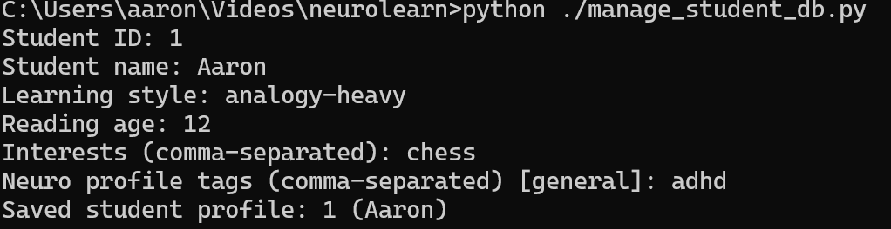
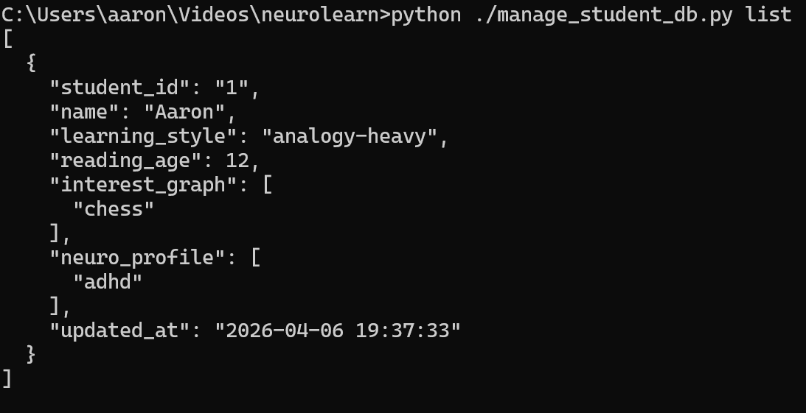
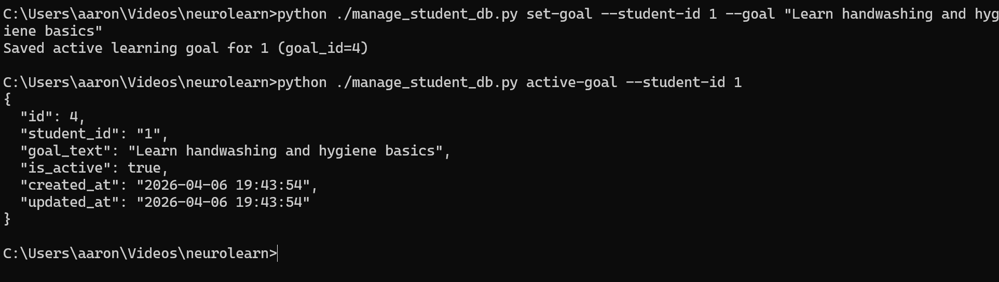
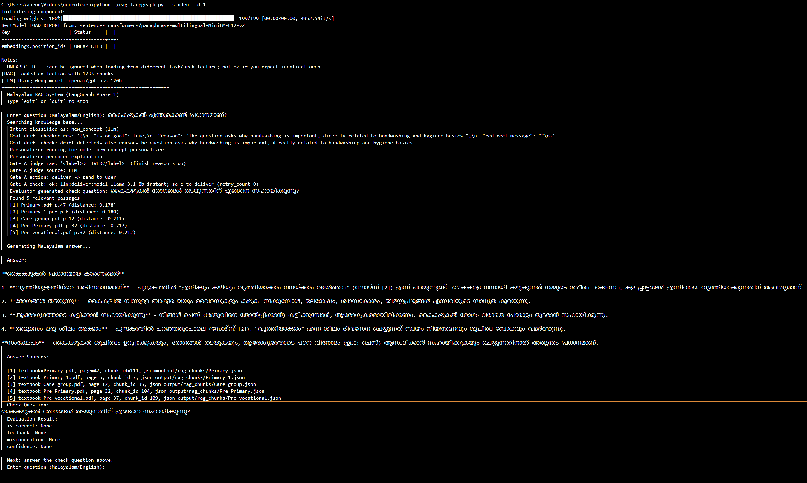
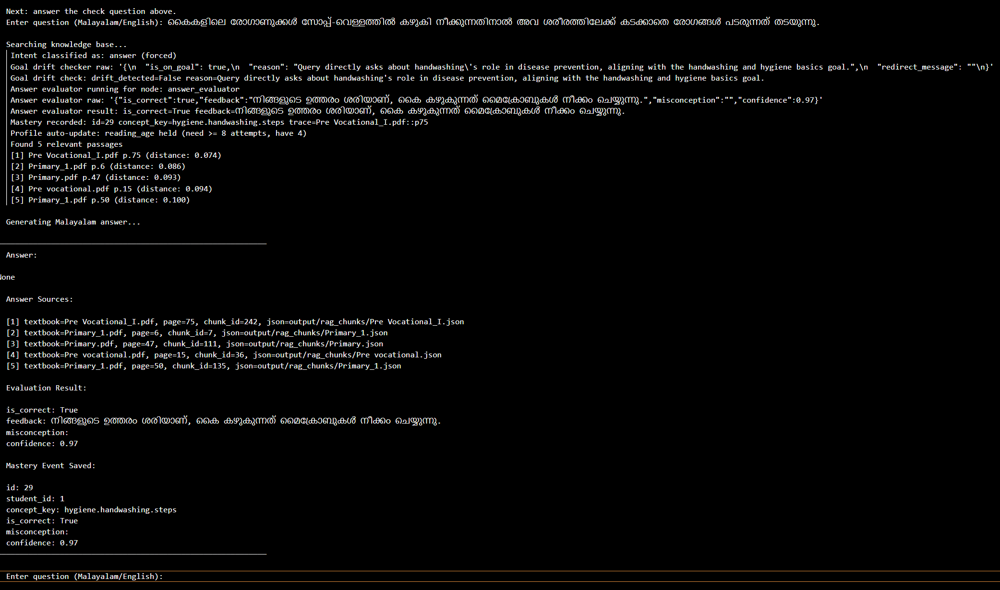
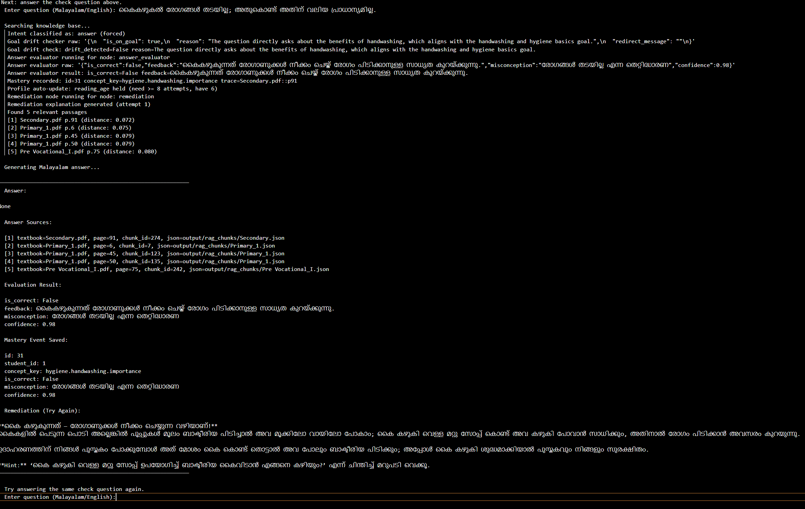
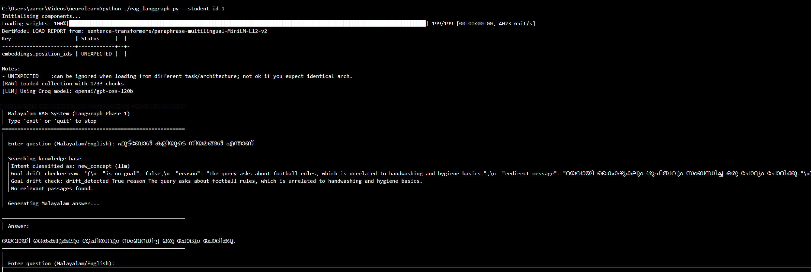

# NeuroLearn Program Execution Test Report

## Test Execution Log (Detailed)

## Test Case T01: Default Student CLI Behavior 

Purpose:
- Validate default interactive add flow from manage_student_db.py.

Command Executed:
- python ./manage_student_db.py

Expected Result:
- Program enters interactive profile creation prompts.

Actual Result:
- PASS after fixes. Script defaults to interactive add flow and prompts for fields.

Verified:
- CLI entry, DB loading, and interactive student prompt flow work as expected.

Evidence:

---

## Test Case T02: Student Listing Verification

Purpose:
- Validate student records are persisted and retrievable.

Command Executed:
- python ./manage_student_db.py list

Expected Result:
- JSON output with student records, including name.

Actual Result:
- PASS. Records returned with expected fields.

Verified:
- Student DB persistence and retrieval are working.

Evidence:

---

## Test Case T03: Goal Management Workflow

Purpose:
- Verify set-goal, active-goal, and goals history operations.

Commands Executed:
- python ./manage_student_db.py set-goal --student-id 1 --goal "Learn handwashing and hygiene basics"
- python ./manage_student_db.py active-goal --student-id 1
- python ./manage_student_db.py goals --student-id 1 --limit 10

Expected Result:
- Goal saved and retrievable as active; historical list available.

Actual Result:
- __________________________

Verified:
- Goal creation, active-goal lookup, and goal history listing are working.

Evidence:

---

## Test Case T04: LangGraph Interactive New Concept Flow

Purpose:
- Validate the interactive on-goal concept flow: retrieval -> personalization -> gate -> evaluator.

Command Executed:
- python ./rag_langgraph.py --student-id 1

Interactive Input:
- കൈകഴുകൽ എന്തുകൊണ്ട് പ്രധാനമാണ്?

Expected Result:
- Answer generated in Malayalam with source references and check question.

Actual Result:
- __________________________

Verified:
- Intent classifier, drift checker, retrieval, personalizer, gate, evaluator, and interactive follow-up flow are working.

Evidence:

---

## Test Case T05: Answer Evaluation (Correct)

Purpose:
- Validate correct answer path completes without remediation.

Command Executed:
- python ./rag_langgraph.py --student-id 1

Interactive Input:
- എന്റെ ഉത്തരം: ______________________________________

Expected Result:
- evaluation_result with is_correct true and mastery saved.

Actual Result:
- __________________________

Verified:
- Answer-path evaluation, mastery recording, and correct-answer completion are working.

Evidence:

---

## Test Case T06: Answer Evaluation (Incorrect -> Remediation)

Purpose:
- Validate answer path scoring and remediation output on incorrect response.

Command Executed:
- python ./rag_langgraph.py --student-id 1

Interactive Input:
- എന്റെ ഉത്തരം: ഇത് വേറൊരു വിഷയമാണ്

Expected Result:
- evaluation_result with is_correct false, feedback/misconception/confidence, remediation text.

Actual Result:
- __________________________

Verified:
- Answer-path evaluation, remediation generation, and mastery recording for incorrect answers are working.

Evidence:

---

## Test Case T07: Drift Redirect Flow

Purpose:
- Validate off-goal input triggers drift redirect behavior.

Command Executed:
- python ./rag_langgraph.py --student-id 1

Interactive Input:
- ഫുട്ബോൾ കളിയുടെ നിയമങ്ങൾ എന്താണ്

Expected Result:
- Off-goal detection and short Malayalam refocus response.

Actual Result:
- __________________________

Verified:
- Goal drift detection and redirect handling are working.

Evidence:

---

## End of Test Log
