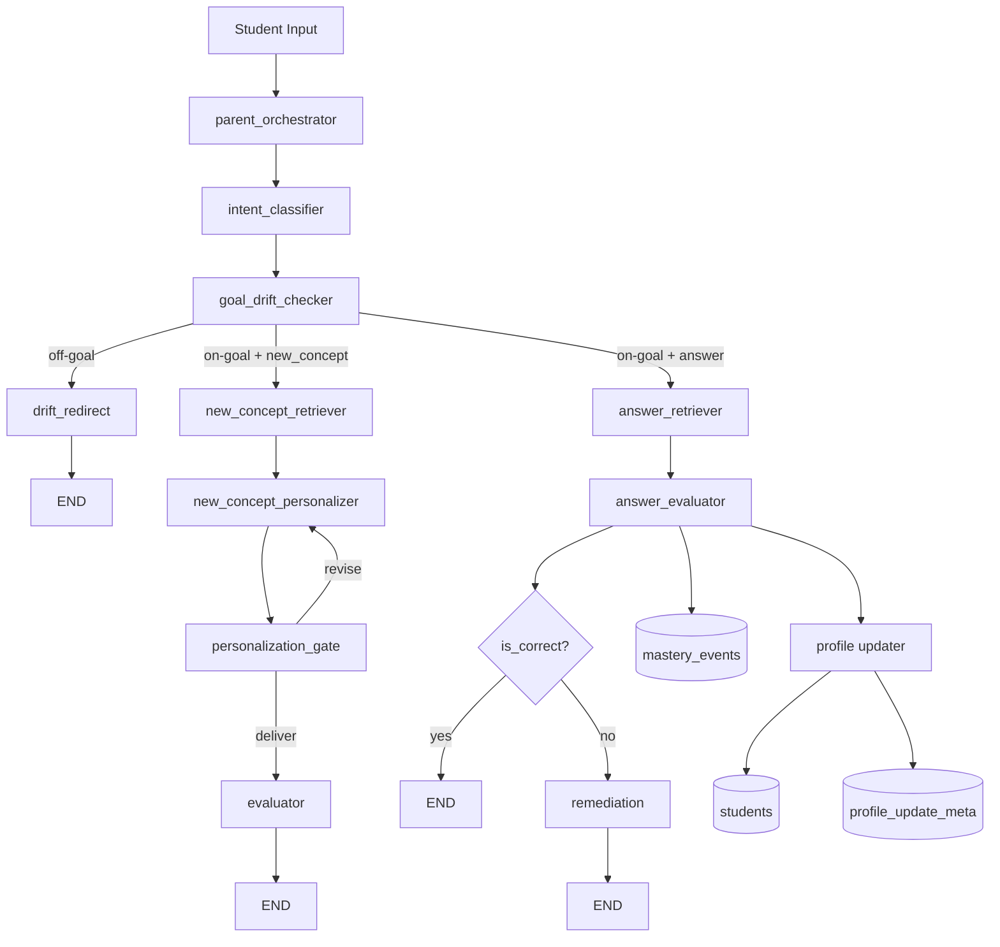

# NeuroLearn Current Architecture Plan

This document reflects the architecture that is currently implemented in code.

## Document Status

- Scope: architecture blueprint (implemented state)
- Audience: architects, developers, reviewers
- Status: current MVP architecture

## 1) Core Design

The app uses a Parent-Orchestrator style LangGraph with conditional routing:

1. Intent classification
2. Learning-goal drift check
3. On-goal branch execution (`new_concept` or `answer`)
4. Evaluation/remediation and persistence

## 2) Implemented Graph



## 3) Node Responsibilities

- `parent_orchestrator`: Graph entry point.
- `intent_classifier`: Classifies user input into `new_concept` or `answer`.
- `goal_drift_checker`: Compares query with active learning goal.
- `drift_redirect`: Sends short Malayalam refocus response for off-goal input.
- `new_concept_retriever`: Retrieves context chunks from vector DB.
- `new_concept_personalizer`: Generates tailored explanation.
- `personalization_gate`: Ensures complexity is suitable before delivery.
- `evaluator`: Generates check-for-understanding question.
- `answer_retriever`: Retrieves context for answer evaluation.
- `answer_evaluator`: Scores student answer and delegates mastery side effects.
- `remediation`: Provides simpler correction when answer is incorrect.

Supporting module:

- `langgraph_app/graph/mastery.py`: semantic concept-key generation, source tracing, mastery persistence, and profile-updater side effects.

## 4) Personalization Inputs

Student profile fields used at runtime:

- `learning_style`
- `reading_age`
- `interest_graph`
- `neuro_profile`

Neurodivergent adaptation behavior:

- Known conditions (e.g., ADHD/autism/dyslexia) apply specific communication rules.
- Unknown/custom conditions are still supported via open-ended accommodation instructions.
- LLM is instructed to optimize clarity and reduce cognitive overload.

## 5) Data Model (SQLite)

### `students`
- `student_id` (PK)
- `name`
- `learning_style`
- `reading_age`
- `interest_graph` (JSON)
- `neuro_profile` (JSON)
- `created_at`
- `updated_at`

### `mastery_events`
- `id` (PK)
- `student_id` (FK)
- `concept_key`
- `is_correct`
- `misconception`
- `confidence`
- `source_doc`
- `source_page`
- `source_chunk_id`
- `created_at`

### `profile_update_meta`
- `student_id` (PK/FK)
- `last_reading_age_update_event_id`

### `learning_goals`
- `id` (PK)
- `student_id` (FK)
- `goal_text`
- `is_active`
- `created_at`
- `updated_at`

## 6) Guardrails

### Gate A Complexity Guardrail
- LLM judges complexity with conservative delivery preference.
- Only loops for revision when clearly over-complex.

### Profile Updater Guardrails
- Minimum attempts before reading-age change: 8
- Hysteresis:
  - Increase when success rate >= 0.80
  - Decrease when success rate <= 0.35
- Cooldown: max one reading-age change per 10 events

### Drift Guardrail
- If query is off active learning goal, route to `drift_redirect` and end the turn.

## 7) Output Traceability

The CLI prints:

- Retrieved passages
- Final answer/check/evaluation/remediation as relevant
- `Answer Sources` with:
  - textbook
  - page
  - `chunk_id` (or vector id fallback)
  - JSON hint path (`output/rag_chunks/<book>.json`)

## 8) Operational Commands

```powershell
python .\manage_student_db.py
# or: python .\manage_student_db.py add --student-id s100 --name "Test User" --learning-style analogy-heavy --reading-age 12 --interests chess football --neuro-profile adhd dyslexia
python .\manage_student_db.py set-goal --student-id s100 --goal "Learn handwashing and hygiene basics"
python .\rag_langgraph.py --student-id s100 --text "Why is handwashing important?"
python .\manage_student_db.py mastery --student-id s100 --limit 20
```

## 9) Current Stage

This is an MVP with functional end-to-end loops for:

- on-goal concept teaching
- answer evaluation
- remediation
- profile/memory updates
- drift redirection

Next focus should be test automation and evaluation quality regression checks.

## Related Docs

- [README.md](README.md)
- [FLOW.md](FLOW.md)
- [FROM_SCRATCH_SUMMARY.md](FROM_SCRATCH_SUMMARY.md)
