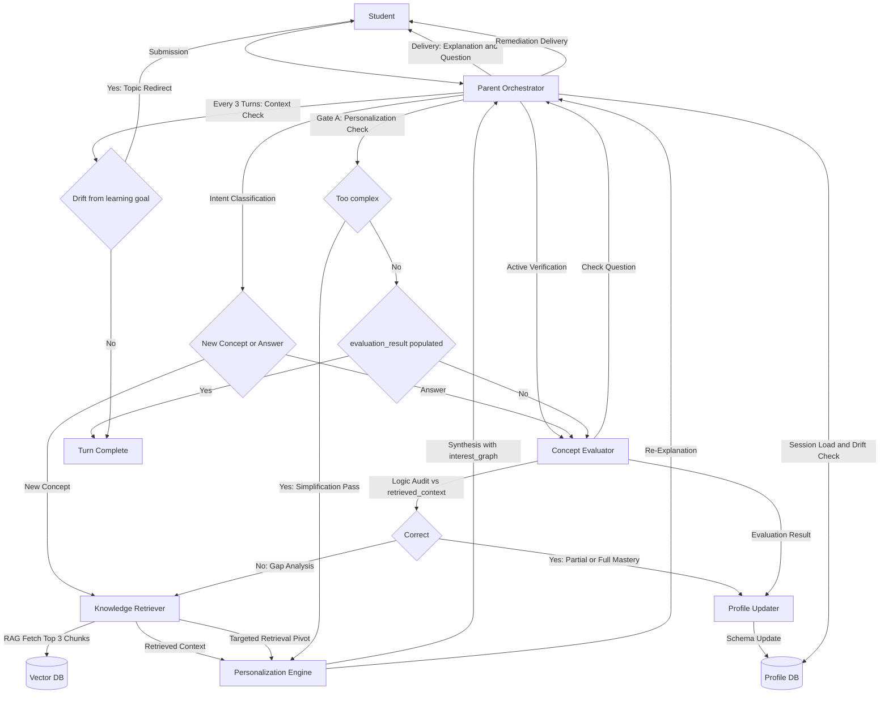

# Personalized Hierarchical Education Agent (LangGraph)

This architecture uses a strict Orchestrator-Worker pattern.
The Parent Agent is the single point of entry and exit, so every response is routed, personalized, evaluated, and tracked before it reaches the student.

## 1. Sub-Agent Definitions and KPIs

| Sub-Agent | Technical Role | Success Metric (KPI) |
|---|---|---|
| Parent Orchestrator | Supervisor/Router: interprets user intent and chooses the correct graph path. | Routing Accuracy: correctly classifies New Concept vs Answer at 98%. |
| Knowledge Retriever | Context Provider: connects to Vector DB (RAG) and pulls chunked educational data. | Faithfulness: output is fully grounded in retrieved docs, no hallucinations. |
| Personalization Engine | Style Transformer: maps raw knowledge to reading level and interests. | Alignment: response includes the learner's interest keywords. |
| Concept Evaluator | Diagnostic Analyst: compares user response against ground truth from retrieved context. | Precision: correctly distinguishes Partial Mastery vs Misconception. |
| Profile Updater | Data Sync: converts natural language evaluation into structured DB updates. | Schema Integrity: updates mastery matrix fields correctly. |

## 2. Memory Architecture and Data Schema

### A. Persistent Long-Term Memory (Profile DB)

Loaded at the start of every session (PostgreSQL/Supabase).

- Student Profile Table:
    - `learning_style` (for example: Socratic, Analogy-heavy, Direct)
    - `interest_graph` (JSON array of analogy keywords)
    - `reading_age` (integer controlling vocabulary complexity)
- Mastery Matrix Table:
    - `concept_id` (unique curriculum concept id)
    - `proficiency_score` (float from 0.0 to 1.0)
    - `attempts_count` (engagement count per concept)

### B. Ephemeral Short-Term Memory (LangGraph State)

Shared graph state across nodes:

```python
class EducationState(TypedDict):
        user_input: str
        student_profile: dict                  # Loaded from DB at start
        retrieved_context: str                 # Raw RAG data
        personalized_explanation: str          # Final output text
        evaluation_result: dict                # {"is_correct": bool, "feedback": str}
        internal_monologue: str                # Parent reasoning for debugging
        active_node: str                       # Current sub-agent in control
```

## 3. Detailed Functional Flows

### Flow 1: New Knowledge Loop

1. Intent Classification: Parent detects the user wants to learn something new.
2. RAG Fetch: Retriever pulls top 3 relevant chunks from the Vector DB.
3. Synthesis: Personalizer combines retrieved chunks and `interest_graph` to produce relatable analogies.
4. Active Verification: Parent forces Evaluator to generate a check-for-understanding question based only on retrieved content.
5. Delivery: User receives explanation plus question.

### Flow 2: Correction and Remediation Loop

1. Submission: User answers the question.
2. Logic Audit: Evaluator compares user answer with `retrieved_context`.
3. Gap Analysis: If incorrect, Evaluator identifies the misconception.
4. Pivot: Parent triggers Retriever with targeted query (for example, gravity vs air pressure differences).
5. Re-Explanation: Personalizer delivers a focused correction.

## 4. State Machine Logic (Guardrails)

### No-Skip Policy

- Gate A (Personalization Check): if `personalized_explanation` is too complex, route back to Personalizer for simplification.
- Gate B (Evaluation Requirement): `END` is unreachable unless `evaluation_result` is populated.

### Drift Guardrail

Every 3 turns, Parent runs a context check against the Mastery Matrix.
If drift is detected, Parent redirects the learner back to the original learning goal.

## 5. Example Interaction Scenarios

| Scenario | Parent Decision | Sub-Agent Chain |
|---|---|---|
| User asks a Why question | Deep Dive | RAG -> Personalizer -> Evaluator |
| User gives a vague answer | Probe for Clarity | Evaluator (requests more detail) -> User |
| User expresses frustration | Emotional Support | Personalizer (encouraging tone) -> RAG (simpler content) |
| User masters a topic | Progress Update | Evaluator -> Profile Updater -> Parent (suggests next topic) |

## 6. Technical Integration Requirements

- Orchestration: LangGraph using `StateGraph` for cycles.
- Vector Store: requires metadata filters (for example `grade_level`) during RAG.
- Latency: stream Personalizer output while Evaluator prepares quiz in background.

## Things Not Included

1. Personalized voice.
2. Runtime subject switching.
3. MCP tool integration for teacher progress updates.
4. Safety guardrail that checks output against student profile for distress triggers.

## Main System Graph (Process-Labeled)


